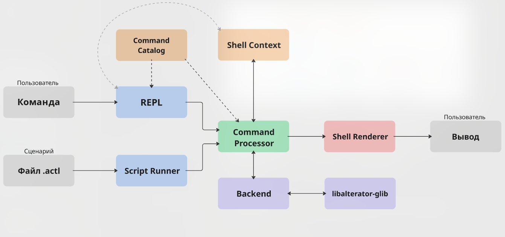

# Исследование shell-режима

## 1. Цель исследования

Цель - спроектировать `actl-shell` как рабочую среду для Alterator, а не цикл чтения и выполнения CLI-команд.

## 2. Резюме предлагаемого решения

Первая версия - лёгкий клиент для исследования и многошагового управления Alterator. Её основные функции:

1. Навигация по модулям с сохранением активного контекста.
2. Контекстная справка и автодополнение из единого каталога команд.
3. История, поиск и редактирование предыдущих команд.
4. Абсолютный вызов команды без выхода из текущего контекста.
5. Безопасные настройки и просмотр состояния сессии.
6. Выполнение простых воспроизводимых сценариев через `source`.
7. Продолжение сессии после ошибки отдельной команды.

Она подключает все восемь модулей и команды текущего `actl`. Object context и динамическое автодополнение сначала проверяются на `services`.

Типизированные результаты, переменные, `watch`, фоновые jobs, TUI и общее плагинное ядро остаются после MVP.
## 3. Исходное состояние alteratorctl

### 3.1. Модель одноразового CLI

Текущая грамматика:

```text
alteratorctl [OPTIONS]
alteratorctl <MODULE> [COMMAND] [OPTIONS]
alteratorctl <MODULE> <SUBMODULE> [COMMAND] [OPTIONS]
```

На каждый вызов приложение заново регистрирует модули, разбирает `argc/argv`, выполняет одну команду и завершается. `actl` - короткое имя того же файла.

В `main` зарегистрированы восемь модулей:

| Модуль | Основные команды |
|---|---|
| `manager` | `getobjects`, `getifaces`, `getsignals` |
| `packages apt` | `info`, `install`, `list`, `reinstall`, `remove`, `search`, `update`, `last-update` |
| `packages rpm` | `files`, `info`, `install`, `list`, `packageinfo`, `remove` |
| `packages repo` | `add`, `info`, `list`, `remove` |
| `components` | `list`, `info`, `description`, `search`, `status`, `install`, `remove` |
| `editions` | `list`, `list-available`, `description`, `license`, `info`, `set`, `get` |
| `diag` | `list`, `list-available`, `info`, `report`, `run`, `help` |
| `systeminfo` | `description`, `hostname`, `name`, `arch`, `branch`, `edition`, `kernel`, `cpu`, `gpu`, `memory`, `drive`, `monitor`, `motherboard`, `locales`, `desktops` |
| `services` | `list`, `list-available`, `info`, `resources`, `status`, `deploy`, `configure`, `start`, `stop`, `backup`, `restore`, `undeploy`, `diagnose`, `play` |
| `sources` | `list`, `list-available`, `show`, `entries`, `enable`, `disable`, `check-sign` |

### 3.2. Справка и автодополнение

Справка - обычный текст. Единой схемы команд, аргументов, опций и результатов нет. Код и общая справка местами расходятся: некоторые `list-available` в коде есть, а в справке - нет.

Bash- и Fish-completion запускают `alteratorctl --help` и разбирают его через `grep`, `sed` и `awk`. Для `services` отдельно вызывается `actl services list`, а имена сервисов кэшируются в `/tmp`.

В shell help и автодополнение должны читать Command Catalog, а динамические значения - API.

### 3.3. Интерактивное поведение существующих команд

Текущий CLI уже:

- учитывает наличие TTY;
- запрашивает подтверждение опасных пакетных, компонентных, сервисных и source-операций;
- поддерживает явные `--yes` и `--force-yes` для соответствующих команд;
- регистрирует текстовый Polkit-agent;
- обрабатывает потоковый вывод диагностических операций;
- может учитывать ширину терминала и использовать pager.

Shell должен сохранить это поведение. 

## 4. Базовая модель взаимодействия

Синтаксис существующих команд сохраняется:

```text
$ actl-shell
actl> systeminfo hostname
workstation-01

actl> services list
...

actl> exit
```

Жизненный цикл сессии:

```text
запуск
    -> инициализация shell и восстановление состояния
    -> интерактивный цикл
        -> чтение команды
        -> выполнение команды
        -> вывод результата
    -> exit, quit или Ctrl+D
    -> сохранение history и освобождение ресурсов
```

Ошибка команды возвращает не завершает shell.

### 4.1. Пользовательская ценность постоянной сессии

В одноразовом CLI поиск объекта, проверка состояния, изменение и повторная проверка выполняются отдельными вызовами.

В shell этот цикл выглядит как одна задача:

```text
actl> use services
actl:services> list
actl:services> use samba
actl:services/samba> status
actl:services/samba> start
actl:services/samba> status
```

Shell сохраняет контекст и историю, а также предлагает автодополнение с учётом текущего модуля и выбранного объекта. Это ускоряет исследование незнакомого модуля и цикл "посмотреть -> изменить -> проверить".

Для одной команды, CI и Bash-скрипта остаётся обычный `actl`. Shell не хранит опасные разрешения и не повторяет изменения после потери соединения.

## 5. Объектная навигация и контексты

### 5.1. Решаемая проблема

Контекст решает более узкую проблему: модуль и объект повторяются в каждом вызове:

```bash
actl services info samba
actl services status samba
actl services stop samba
actl services start samba
```

Это увеличивает объём ввода и риск выбрать не тот объект.

### 5.2. Пользовательская ценность

В shell модуль и объект выбираются один раз:

```text
actl> use services
actl:services> list
actl:services> use samba
actl:services/samba> info
actl:services/samba> status
actl:services/samba> stop
actl:services/samba> start
```

### 5.3. Команды навигации

```text
modules                 показать модули
ls                      показать элементы текущего контекста
use <module>            выбрать модуль
use <object>            выбрать объект внутри модуля
back                    подняться на один уровень
root                    перейти в корневой контекст
pwd                     показать путь контекста
```

При выбранном объекте первый `back` снимает выбор, второй поднимается по дереву.
`root` сразу возвращает в корневой контекст. Относительный `help` относится к
shell, а абсолютный `/diag help` - к Python-модулю.

Пример вертикального прототипа для `services`:

```text
actl> use services
actl:services> ls
chrony
samba
actl:services> use samba
actl:services/samba> pwd
/services/samba
actl:services/samba> status
...
actl:services/samba> root
actl>
```

---
## 6. Сценарии через source

### 6.1. Пользовательская модель

```text
actl> source inspect.actl
```

Файл `inspect.actl`:

```text
# Инвентаризация локальной системы
systeminfo description
editions get --name-only
services list
sources list
diag list
```

Создание из истории:

```text
actl> history
4 systeminfo description
5 editions get --name-only
6 services list
7 sources list
8 diag list
actl> history save inspect.actl 4..9
actl> source inspect.actl
```

### 6.2. Семантика первой версии

Первая версия поддерживает:

- одну команду на строку;
- пустые строки и комментарии;
- существующие команды actl;
- встроенные `use`, `back`, `root`;
- `source` другого файла с ограничением глубины;
- номера файла и строки в диагностике;
- явную политику остановки после ошибки.

```text
actl> source --stop configure.actl
actl> source --continue inspect.actl
```

По умолчанию действует `stop`.

### 6.3. Подтверждения и безопасность

Интерактивный `source` запрашивает подтверждение.

Ограничения:

- обнаружение рекурсивных `source`;
- ограничение глубины вложения;
- относительные пути разрешаются относительно текущего script-файла;
- файл не может незаметно изменить постоянные опасные настройки;
- `exit` внутри файла завершает только текущий файл - сценарий не может неявно завершить родительский shell;
- секреты не печатаются вместе с исполняемой строкой.

## 7. Инфраструктура интерактивной работы

### 7.1. Редактирование и история

История избавляет от повторного ввода и сохраняет найденные последовательности.
В ней только команды `actl-shell`, поэтому поиск точнее, чем во внешнем shell.

- `Up`/`Down` - история;
- `Ctrl+R` - обратный поиск;
- `Ctrl+A`/`Ctrl+E` - начало и конец строки;
- `Ctrl+W`, `Ctrl+U`, `Ctrl+K` - редактирование;
- `Ctrl+L` - очистка экрана;
- `history` - просмотр;
- `history save <file> <range>` - создание сценария из найденных команд.

Пример:

```text
actl:services> <Ctrl+R>
reverse-i-search: configure samba
actl:services> configure samba --workgroup=OFFICE

actl:services> history save samba-check.actl 12..16
Saved 5 commands to samba-check.actl
```

Файл истории имеет ограниченный размер и права владельца.

### 7.2. Автодополнение

Автодополнение знает контекст, имена объектов и допустимые аргументы. Динамические значения берутся из кэша сессии.

Уровни дополнения:

1. Встроенные команды и модули.
2. Команды, подкоманды и статические опции.
3. Объекты: сервисы, компоненты, редакции.
4. Динамические параметры конкретного сервиса и enum-значения.
5. Имена переменных и доступные поля структурированного результата.

### 7.3. Справка и описание

```text
actl> help
actl> help services
actl> help services configure
```

Статическая справка работает без D-Bus.

### 7.4. Сигналы и ошибки

- `Ctrl+C` на строке очищает ввод;
- `Ctrl+C` во время команды запрашивает отмену;
- `Ctrl+D` на пустой строке завершает shell;
- ошибка команды обновляет состояние последней команды и возвращает prompt;
- фатальной считается только ошибка состояния самого shell.

После появления `watch`, `Ctrl+C` завершает просмотр, а не приложение.

## 8. Сравнение с одноразовым CLI

| Свойство           | `actl`                                | `actl-shell`                                |
| ------------------ | ------------------------------------- | ------------------------------------------- |
| Модель             | Один процесс на команду               | Постоянная сессия                           |
| Контекст           | Повторяется в каждом argv             | Активные module/object                      |
| История            | История внешнего shell                | Предметная история и создание сценариев     |
| Автодополнение     | Парсинг help, отдельные shell-скрипты | Command Catalog и dynamic providers         |
| Сценарии           | Внешний Bash скрипт                   | Встроенное выполнение файлов через `source` |
| Соединения/кэш     | Создаются заново                      | Управляются в session context               |
| Подтверждения      | TTY/`--yes`                           | Те же гарантии в постоянной сессии          |
| CI и одна операция | Оптимальный вариант                   | Избыточен                                   |

Shell подходит для исследования, диагностики и многошаговой ручной работы.
Обычный actl подходит для одной известной операции, CI и запуска команд по расписанию.

## 9. Минимально жизнеспособный продукт

### 9.1. Функциональное покрытие

- корневой контекст и активный module context для всех восьми модулей;
- все существующие команды текущего `actl` с прежними аргументами;
- вложенные контексты `packages/apt`, `packages/rpm`, `packages/repo`;
- один объектный context adapter для `services` как вертикальный прототип;
- относительные и абсолютные команды;
- `modules`, `ls`, `use`, `back`, `root`, `pwd`, `help`;
- `history save` и `source` с комментариями, номерами строк и `stop-on-error`;

### 9.2. Интерактивная инфраструктура

- редактирование строки ввода и сохранение истории между запусками;
- поиск `Ctrl+R` и стандартные горячие клавиши;
- автодополнение модулей и параметров из каталога команд;
- автодополнение имён сервисов через backend;
- help без обязательного D-Bus подключения;
- корректные `Ctrl+C`, `Ctrl+D`, `exit`, `quit`;
- отображение существующего потокового progress;
- сохранение подтверждений и Polkit-поведения существующего CLI;
- продолжение сессии после ошибки;
- отсутствие утечки опций между последовательными командами.

## 10. Предлагаемая архитектура



 У Command Processor есть два источника команд: интерактивный ввод через REPL и строки сценария через Script Runner. REPL использует Command Catalog для справки и автодополнения, а Shell Context - для формирования prompt. Command Processor использует тот же каталог для разрешения и проверки команды, а контекст - для обработки относительных команд и навигации. Предметная операция передаётся Backend, который обращается к libalterator-glib. Результат возвращается в Command Processor, передаётся Shell Renderer и выводится в терминал.

Подробнее в [«Архитектура MVP»](./architecture.md).
